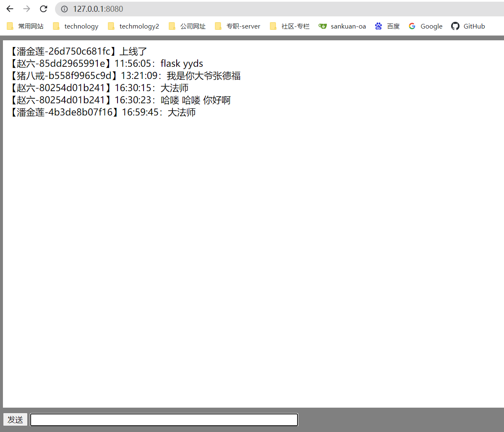

[gorilla websocket github链接](https://github.com/gorilla/websocket) 

安装依赖
```
go get github.com/gorilla/websocket
go get github.com/gin-gonic/gin
go get github.com/gomodule/redigo
go get github.com/satori/go.uuid
```

启动: 默认ip和port, 127.0.0.1:8080
`go run main.go client.go hub.go`

自定ip和端口启动
`go run .\main.go .\hub.go .\client.go --addr="127.0.0.1:8080"`

tools.go文件代码如下：
```go
package main

import "github.com/gomodule/redigo/redis"

// GetRedisConn 获取redis链接
func GetRedisConn() (redis.Conn, error) {
	return redis.Dial(
		"tcp",
		"host:port",
		redis.DialPassword("pwd"),
		redis.DialDatabase(0),
	)
}
```

注意：如果你的项目名称和websocket-chat不一致，可能会报错误，直接把go.mod和go.sum删除掉
然后执行两个命令
```
go mod init
go mod tidy
```

// 生产环境变量的配置
// GIN_MODE=release是gin框架生产的配置
```
export GOROOT=/usr/lib/go
export GOPATH=/home/mayanan/GOPATH
export GIN_MODE=release
```

// 项目效果图

